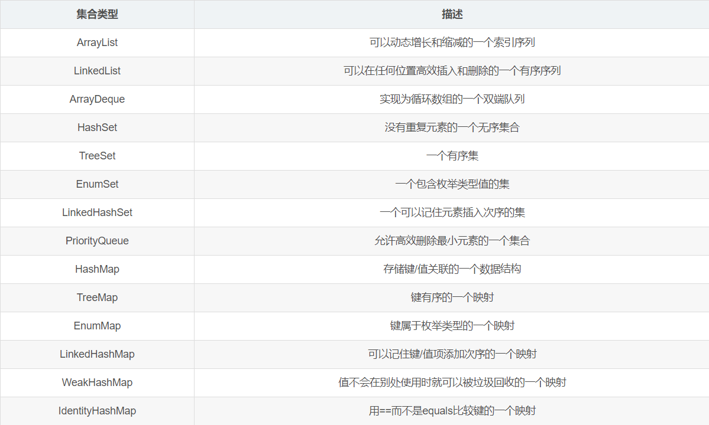
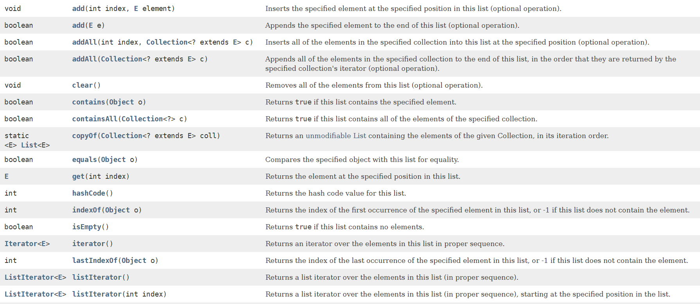
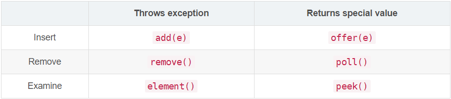
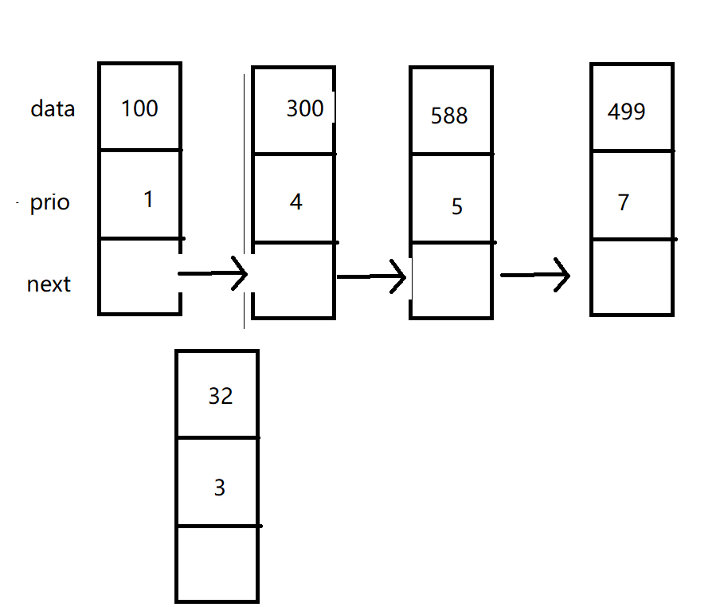

## List

*   可以重复
*   记录放入顺序
*   ArrayList、 LinkedList 和 Vector 三个实现类

在Java中，所有链表实际上都是双向链接的——即每个链接还存放着其前驱的引用。

LinkedList类可以使用ListIterator类从前后两个方向遍历链表中的元素，以及删除和添加元素。

**链表不支持快速随机访问**。如果要查看链表中的第n个元素，就必须从头开始，越过n-1个元素。鉴于这个原因，当需要按整数索引访问元素时，通常不选用链表。

避免使用以整数索引表示链表中位置的所有方法。如果需要对集合进行随机访问，就使用数组或ArrayList，而不要使用链表

### List 接口的一些方法

在链表末尾添加一个元素

```
boolean add(E e)
```

在指定位置添加一个元素

```
void add(int index, E element)
```

将一个集合添加到链表的末尾

```
boolean addAll(Collection<? extends E> c)
```

将一个集合添加到链表的指定位置

```
boolean addAll(int index, Collection<? extends E> c)
```

清除所有元素

```
void clear()
```

检索链表是否含有某个对象

```
boolean contains(Object o)
```

判断链表是否包含指定集合的全部元素

```
boolean	containsAll(Collection<?> c)
```




### ArrayList

就是一个动态数组


### LinkedList

>   LinkedList底层是通过双向链表实现的。所以，LinkedList和ArrayList之前的区别主要就是数组和链表的区别

*   数组查询 赋值快
*   链表 删除，增加快

**实现了 List Queue 两个接口**

一些新方法

Returns a shallow copy of this `LinkedList`.

```
Object	clone()
```

以相反的顺序返回此双端队列中的元素的迭代器

```
Iterator<E>	descendingIterator()
```

获取表头表尾

```
getFirst()   getLast()
```


### Vector

最大特点：线程安全，效率低，性能低

实现了**AbstractList接口**

自己的方法

 Returns the current capacity of this vector.

```
int	capacity()
```

复制到新数组中去

```
void	copyInto(Object[] anArray)
```

搜索指定位置之前的元素，是否有指定元素

```
int	indexOf(Object o, int index)
```


## 队列Queue

**特点** 

*   快速地在尾部添加元素，在头部删除元素   
*   不支持插入元素

这个接口定义了6个方法，功能分成3个，分别是插入、删除、获取队首元素，每个功能有2种实现，对应如下表中的关系。这两种实现的区别也很明显



*   add(e) 和 offer(e)：添加失败时，add抛异常，offer返回false
*   remove() 和 poll() ：没有元素时，remove抛异常，poll返回null
*   element() 和 peek()：没有元素时，remove抛异常，peek返回null

**Queue通常不允许插入null值**


### 优先队列PriorityQueue

优先队列的简单说就是在普通队列中加入标志，比如我们用数字 0  1 2 3来表示，数字小的对应节点的优先级就高，我们就将他放在合适的位置

 

一般的创建方式是

用指定的容量和指定的比较器规则排序来创建的优先队列

```
PriorityQueue(int initialCapacity, Comparator<? super E> comparator)
```


**使用步骤**

1.  先创建节点（对象）

```java
class Node {
	public int key;  // 第一优先键值
	public int sec;  // 第二优先键值
}
```

2.  需要先创建比较器   指定比较器的规则   一般含有两个键值

```java
		Comparator<Node> comparator = new Comparator<Node>() {
			public int compare(Node a, Node b) { //这里是小根堆
				if (a.key == b.key) return a.sec - b.sec; //第二键值做参考
				return a.key - b.key; //第一键值做参考
			}
		};
```

3.  然后根据比较器创建 优先队列

```java
Queue<Node> pq = new PriorityQueue<>(comparator);
```

4.  使用方法对多种对象进行排序

**示例代码**

```java
import java.util.PriorityQueue;

class Node 
{
	public int key;
	public int sec;
}

public class p1{
	static Node []A = null;
	public static void main(String args[]) 
	{
		Scanner in = new Scanner(System.in);
		Comparator<Node> cmp = new Comparator<Node>() {
			public int compare(Node a, Node b) { //这里是小根堆
				if (a.key == b.key) return a.sec - b.sec; //第二键值做参考
				return a.key - b.key; //第一键值做参考
			}
		};

		Queue<Node> pq = new PriorityQueue<>(cmp);
		int n = in.nextInt();
		A = new Node [n];
		for (int i = 0; i < n; i++) {
			A[i] = new Node();
			A[i].key = in.nextInt();
			A[i].sec = in.nextInt();
			pq.add(A[i]);
		}
		while (!pq.isEmpty()) {
			System.out.println(pq.element().key + " " + pq.element().sec);
			pq.poll();
		}
	}
}
```


**使用场景**

*   女士优先排队
*   多任务时，执行的顺序问题


### 散列集

>   如果不在意元素的顺序，有几种能够快速查找元素的数据结构。其缺点是无法控制元素出现的次序。这些数据结构按照对自己最方便的方式组织元素


散列表 是一种用于快速查找对象的数据结构。散列表为每个对象计算一个整数，称为散列码（hash code）。散列码是由对象的实例字段得出的一个整数。更准确地说，有不同数据的对象将产生不同的散列码。

如果你定义你自己的类，你就要负责实现自己的hashCode方法。你的实现应该与equals方法兼容，即如果a.equals(b)为true，a与b必须有相同的散列码。

在Java中，散列表用链表数组实现。每个列表被称为桶（bucket）。当桶已经被填充时，这种现象称为散列冲突，这时需要将新对象与桶中的所有对象进行比较，查看这个对象是否已经存在，如果散列码合理地随机分布，桶的数目也足够大，需要比较的次数就会很少。

>   在Java 8中，桶满时会从链表变为平衡二叉树


## 映射Map

### 类型介绍

>   Map 接口存储一组键值对象，提供key（键）到value（值）的映射
>
>   **存储的是一对一对的键值对**

Java 自带了各种 Map 类。这些 Map 类可归为三种类型：

1.  通用Map，用于在应用程序中管理映射，通常在 java.util 程序包中实现

```
HashMap、Hashtable、Properties、LinkedHashMap、IdentityHashMap、TreeMap、WeakHashMap、ConcurrentHashMap
```

2.  专用Map，通常我们不必亲自创建此类Map，而是通过某些其他类对其进行访问

```
java.util.jar.Attributes、javax.print.attribute.standard.PrinterStateReasons、java.security.Provider、java.awt.RenderingHints、javax.swing.UIDefaults
```

3.  一个用于帮助我们实现自己的Map类的抽象类

```
AbstractMap
```


### 类型区别

**HashMap**

最常用的Map,它根据键的HashCode 值存储数据,根据键可以直接获取它的值，**具有很快的访问速度**。HashMap最多只允许一条记录的键为Null(多条会覆盖);允许多条记录的值为 Null。非同步的。

**TreeMap**

能够把它保存的记录根据键(key)排序,**默认是按升序排序**，也可以指定排序的比较器，当用Iterator 遍历TreeMap时，得到的记录是排过序的。TreeMap不允许key的值为null。非同步的。 

**Hashtable**

与 HashMap类似,不同的是: key和value的值均不允许为null;它支持线程的同步，即任一时刻只有一个线程能写Hashtable,因此也导致了Hashtale在写入时会比较慢。 

**LinkedHashMap**

保存了记录的插入顺序，在用Iterator遍历LinkedHashMap时，先得到的记录肯定是先插入的.在遍历的时候会比HashMap慢。key和value均允许为空，非同步的。 


### HashMap

```java
    Map<String, String> map = new HashMap<String, String>();
    map.put("key1", "1");  // 插入键值对
    String str = map.get("key1");  // 获取键值对
```
