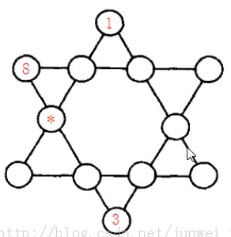

### 填空题

1.  有一堆煤球，堆成三角棱锥形。具体：
    第一层放1个，第二层3个（排列成三角形），第三层6个（排列成三角形），第四层10个（排列成三角形），如果一共有100层，共有多少个煤球？
    请在下方的空格中填写表示煤球总数目的数字。

```java
pubic class t1{
	public static void main(String[] args){
		double x = 1;
		double y = 0;
		double sum = 0;

		for(; x <= 100; x ++){
			y = x * x / 2 + x / 2;
			sum = sum + y;
		}
		System.out.println("100层有煤球 " + sum + "个");
	}
}

## 100层有煤球 171700个
```


2.  某君从某年开始每年都举办一次生日party，并且每次都要吹熄与年龄相同根数的蜡烛。现在算起来，他一共吹熄了236根蜡烛。请问，他从多少岁开始过生日party的？请在下方的空格中填写他开始过生日party的年龄数。

```java
class Main{
	public static void main(String[] args){
		int candles = 0;
		int age_now = 4;  
		int age_start = 2;

		for(;age_now < 100; age_now ++, age_start = 2){
			for(;age_start < age_now; age_start ++){
				candles = (age_now + age_start)*(age_now - age_start + 1) / 2;
				if(candles == 236)
					break;
			}
			if(candles == 236)
				break;
		}


		System.out.println("开始举办Party的生日年龄: " + age_start);
		System.out.println("今年已经: " + age_now + "岁了");
	}
}
// 开始举办Party的生日年龄: 26
// 今年已经: 33岁了
```

一开始陷入误区：认为年龄相减就是项数。实际上需要加上一才是项数


3.  某君新认识一网友。当问及年龄时，他的网友说：“我的年龄是个2位数，我比儿子大27岁，如果把我的年龄的两位数字交换位置，刚好就是我儿子的年龄”。请你计算：网友的年龄一共有多少种可能情况？提示：30岁就是其中一种可能哦
    请在下方的空格中填写表示可能情况的种数。

```java
class Main{
	public static void main(String[] args){
		int x, y;
		int father_age = 0;
		int son_age = 0;

		for(x = 2; x <= 9; x ++)
			for(y = 0; y <= 9; y ++){
				father_age = x*10 + y;
				son_age = y*10 + x;
				if(father_age - son_age == 27)
					System.out.println("网友可能的年龄是：" + father_age);
			}
	}
}
// 网友可能的年龄是：30
// 网友可能的年龄是：41
// 网友可能的年龄是：52
 //网友可能的年龄是：63
// 网友可能的年龄是：74
// 网友可能的年龄是：85
// 网友可能的年龄是：96 
// 7种
```


4.  如下表示一个算是：
    $$
    A + B/C + DEF/GHI = 10
    $$
    这个算式中A~l代表1~9的数字，不同的字母代表不同的数字。
    比如：
    6+8/3+952/714就是一种解法，5+3/1+972/486是另一种解法。
    这个算式一共有多少种解法？请将解法的种数填在下方空格中。

```java
class Main{
	
	public static void main(String[] args) {
		dfs(0);
		System.out.println(ans);
	}
	
	static int[] a = new int[] {1,2,3,4,5,6,7,8,9};
	static int ans=0; // 计数器


	static void dfs(int m) {
		if(m>=9) {
			// 给abcdefghi 赋不同的值
			int A = a[0];
			int B = a[1];
			int C = a[2];
			int D = 100*a[3]+10*a[4]+a[5];
			int E = 100*a[6]+10*a[7]+a[8];

			// for(int i=0;i<9;i++){
			// 	System.out.println("m = " + m);
			// 	System.out.print("a[" + i + "] = " + a[i]+" "); // 打印出使等式成立的情况
			// 	System.out.println();
			// }
 
			if(A*C*E + B*E +D*C == 10*C*E) {
				ans++;  // 计数器加一
				for(int i=0;i<9;i++){
					System.out.print(a[i]+" "); // 打印出使等式成立的情况
				}
				System.out.println();
			}

			return; // 终止函数，返回空值
		}
		
		// 迭代核心
		for(int i = m; i < 9; i ++) {
			swap(m,i);
			dfs(m+1);
			swap(m,i);
		}
		
	}
 
 	// 交换数组中指定位置的两个元素
	static void swap(int i, int j) {
		int t = a[i];
		a[i] = a[j];
		a[j] = t;
	}

}

3 5 1 9 7 2 4 8 6
4 9 3 5 2 8 1 7 6
5 3 1 9 7 2 4 8 6
5 4 3 7 2 6 1 9 8
5 4 9 7 3 8 1 6 2
5 8 6 4 7 3 1 2 9
6 4 2 3 5 8 1 7 9
6 4 2 7 1 8 3 5 9
6 7 3 4 8 5 2 9 1
6 8 3 9 5 2 7 1 4
6 9 8 4 3 7 1 5 2
7 3 2 8 1 9 5 4 6
7 3 2 9 8 1 6 5 4
7 5 3 2 6 4 1 9 8
7 5 3 9 1 2 6 8 4
7 1 4 9 6 8 3 5 2
7 9 6 3 8 1 2 5 4
7 9 6 8 1 3 5 4 2
8 6 9 7 1 2 5 3 4
8 7 6 1 9 5 2 3 4
8 1 3 4 6 5 2 7 9
9 2 4 3 5 8 7 1 6
9 2 4 1 7 8 3 5 6
9 3 4 1 5 7 6 2 8
9 4 8 3 5 6 7 1 2
9 4 8 1 7 6 3 5 2
9 6 8 1 4 3 5 7 2
9 1 3 4 5 2 6 7 8
9 1 3 5 2 4 7 8 6
// 29
```


### 编程题

#### 一

公安人员审问甲、乙、丙、丁四个嫌疑犯，已确知，这四个人当中仅有一人是偷窃者，还知道这四个人的答话，要么完全诚实，要么完全说谎。在回答公安人员的问话中：
　　甲说：“乙没有偷，是丁偷的。”
　　乙说：“我没有偷，是丙偷的。”
　　丙说：“甲没有偷，是乙偷的。”
　　丁说：“我没有偷，我用的那东西是我家里的。”
　　请根据上述四人答话，判断谁是偷窃者。

分析：

设 甲，乙，丙，丁 为 A, B, C, D

则

A：B = 0  D = 1

B：B = 0 C = 1

C:   A = 0 B = 1

D:  D = 0

```java
public class p1{

	public static void main(String[] args){

		int[] thief = {0, 0, 0, 0};  // 先假定都不为小偷  1为小偷

		for(int i = 0; i < 4; i ++){
			thief[i] = 1; // 假设小偷
			if (i > 0) thief[i-1] = 0;  // 复原

			// 判断甲的话
			if( (thief[1] == 0 && thief[3] == 1) || (thief[1] != 0 && thief[3] != 1) );
			else continue;

			// 判断乙的话
			if( (thief[1] == 0 && thief[2] == 1) || (thief[1] != 0 && thief[2] != 1) );
			else continue;

			// 判断丁的话
			if( (thief[0] == 0 && thief[1] == 1) || (thief[0] != 0 && thief[1] != 1) );
			else continue;

			// 丁成立条件单一, 无需判断

			System.out.print((char)(65 + i)); // 打印小偷名字
			break; // 保证只有一个小偷
		}
	}
}
```


#### 二

输入11个整数，计算它们的最大值和最小值
**【样例输入】**

```
0 1 2 3 4 5 6 7 8 9 10
```

**【样例输出】**

```
10 0
```

解答

```java
import java.util.Scanner;

public class p2{
	public static void main(String[] args){

		Scanner scanner = new Scanner(System.in);
		int[] array = new int[11];

        for(int i = 0; i < 11; i ++)
        	array[i] = scanner.nextInt();  //接受一个整数

		pick(array);

	}

	// 选中最大最小值并打印
	static void pick(int[] array){

		int max = array[0];
		int min = array[0];
		for(int j = 0; j < array.length; j ++){
			if(array[j] > max)
				max = array[j];
			if(array[j] < min)
				min = array[j];
		}

    	System.out.println(max + " " + min);
	}

}
```


#### 三

编写一程序，接受用户输入的两个整数，并计算它们的和、差、
　　积、商，程序运行时候输入输出例子如下所示。

注意：输出要严格按照+-*/的顺序，分四行输出，而且中间不能有空格，否则系统会判为错误。
**【样例输入】**

```
3 5
```


**【样例输出】**

```
3+5=8
3-5=-2
3*5=15
3/5=0
```

解答

```java
import java.util.Scanner;

public class p3{
	public static void main(String[] args){

		Scanner scanner = new Scanner(System.in);

		int x = scanner.nextInt();
		int y = scanner.nextInt();

		System.out.println(x + "+" + y + "=" + (x+y));
		System.out.println(x + "-" + y + "=" + (x-y));
		System.out.println(x + "*" + y + "=" + (x*y));
		System.out.println(x + "/" + y + "=" + (x/y));
	}

}
```


#### 四

如图所示六角形中，填入1~12的数字。

使得每条直线上的数字之和都相同。
  图中，已经替你填好了3个数字，请你计算星号位置所代表的数字是多少？



解答

1到12 的和为 78， 每一个数字都被用了两遍   所以6个边的总和为 156 ，每一个边的和为26

```

```


#### 五

首先给出简单加法算式的定义：
　　如果有一个算式(i)+(i+1)+(i+2),(i>=0)，在计算的过程中，没有任何一个数位出现了进位，则称其为简单的加法算式。
　　例如：i=3时，3+4+5=12，有一个进位，因此3+4+5不是一个简单的加法算式；又如i=112时，112+113+114=339，没有在任意数位上产生进位，故112+113+114是一个简单的加法算式。

　　问题：给定一个正整数n，问当i大于等于0且小于n时,有多少个算式(i)+(i+1)+(i+2)是简单加法算式。其中n<10000。
**【输入形式】**
一个整数，表示n
**【输出形式】**
　一个整数,表示简单加法算式的个数
**【样例输入】**

```
4
```


**【样例输出】**

```
3
```

解答

```java
import java.util.Scanner;

public class p5{
	public static void main(String[] args){

		Scanner scanner = new Scanner(System.in);
		// 接收输入
		int n = scanner.nextInt();

		int num = 0; // 计数器
		int sum ; // i + (i+1) + (i+2) 的和
		for(int i = 0; i < n; i ++){
			sum = i + (i+1) + (i+2);
			if(take(i,1) + take(i+1,1) + take(i+2,1) == take(sum,1));
			else continue;
			if(take(i,10) + take(i+1,10) + take(i+2,10) == take(sum,10));
			else continue;
			if(take(i,100) + take(i+1,100) + take(i+2,100) == take(sum,100));
			else continue;
			if(take(i,1000) + take(i+1,1000) + take(i+2,1000) == take(sum,1000));
			else continue;

			num++;
		}

		System.out.println(num);
	}

	// 从整数i中取出j位的数 j代表数量级
	static int take(int i, int j){
		int i_j = 0;  // i的j位数
		if(j == 1) i_j = i - i%10;
		if(j == 10) i_j = (i%100 - take(i, 1))/10;
		if(j == 100) i_j = i%1000 - take(i, 10)*10 - take(i, 1);
		if(j == 1000) i_j = i%10000 - take(i, 100)*100 - take(i, 10)*10 - take(i, 1);

		return i_j;  // 返回该位上的数
	}

}
```


#### 六

 123321是一个非常特殊的数，它从左边读和从右边读是一样的。
　　输入一个正整数n， 编程求所有这样的五位和六位十进制数，满足各位数字之和等于n 。

   数据规模和约定

　　1<=n<=54。
**【输入形式】**
输入一行，包含一个正整数n。
**【输出形式】**
输入一行，包含一个正整数n。
**【样例输入】**

```
52
```


**【样例输出】**

```
899998
989989
998899
```


#### 七

某游戏规则中，甲乙双方每个回合的战斗总是有一方胜利，一方失败。游戏规定：失败的一方要把自己的体力值

的1/4加给胜利的一方。例如：如果双方体力值当前都是4，则经过一轮战斗后，双方的体力值会变为：5，3。
现在已知：双方开始时的体力值甲：1000，乙：2000。
假设战斗中，甲乙获胜的概率都是50%
求解：双方经过4个回合的战斗，体力值之差小于1000的理论概率。
**【输出形式】**
以小数形式表示概率，保留到小数点后3位。
假如概率是50%，程序应该输出0.500


#### 八

编程计算涂满高为2，半径为r的圆形蛋糕表面，需要多少表面积的奶油(只要涂上表面和侧面)
　　读入一个数r，输出需要奶油的表面积，结果保留一位小数
**【样例输入】**

```
5.0
```


**【样例输出】**

```
141.4
```


#### 九

100 可以表示为带分数的形式：100 = 3 + 69258 / 714。

还可以表示为：100 = 82 + 3546 / 197。

注意特征：带分数中，数字1~9分别出现且只出现一次（不包含0）。

类似这样的带分数，100 有 11 种表示法。


**【输入形式】**
从标准输入读入一个正整数N (N<1000*1000)
**【输出形式】**

程序输出该数字用数码1~9不重复不遗漏地组成带分数表示的全部种数。

注意：不要求输出每个表示，只统计有多少表示法！
**【样例输入】**

```
100
```


**【样例输出】**

```
11
```


#### 十

FJ在沙盘上写了这样一些字符串：
　　A1 = “A”
　　A2 = “ABA”
　　A3 = “ABACABA”
　　A4 = “ABACABADABACABA”
　　… …
　　你能找出其中的规律并写所有的数列AN吗？
**【输入形式】**
　仅有一个数：N ≤ 26。
**【输出形式】**
请输出相应的字符串AN，以一个换行符结束。输出中不得含有多余的空格或换行、回车符。
**【样例输入】**

```
3
```


**【样例输出】**

```
ABACABA
```


#### 十一

  编制程序完成下述任务：接受两个数，一个为用户一年期定期存款金额，一个为按照百分比格式表示的利率；程序计算一年期满后本金与利息总额。说明：（1）存款金额以人民币元为单位，可能精确到分；（2）输入利率时不需要输入百分号，例如一年期定期存款年利率为2.52%，用户输入2.52即可；（3）按照国家法律，存款利息所得需缴纳20% 的所得税，计算结果时所得税部分应扣除。
**【输入形式】**
　输入一行，包含两个实数，分别表示本金和年利率。
**【输出形式】**
输出一行，包含一个实数，保留到小数点后两位，表示一年后的本金与利息和。
**【样例输入】**

```
10000 2.52
```


**【样例输出】**

```
10201.60
```


#### 十二

下列乘法算式中：每个汉字代表1个数字（0~9）。相同的汉字代表相同的数字，不同的汉字代表不同的数字。
赛软件 * 比赛  =  软件比拼
试编程确定使得整个算式成立的数字组合，如有多种情况，请给出所有可能的答案。
【参考结果】
465*14=6510


#### 十三

　输入a和b的值，求一元一次方程的ax+b=0的解。且数据均在double类型以内,且一定有解（保留2位小数）
**【样例输入】**

```
2 6
```


**【样例输出】**

```
-3.00
```


#### 十四

将1，2，…，9共9个数分成三组，分别组成三个三位数，且使这三个三位数构成
　　1：2：3的比例，试求出所有满足条件的三个三位数。
　　例如：三个三位数192，384，576满足以上条件。
**【输入形式】**
　无输入文件
**【输出形式】**
输出每行有三个数，为满足题设三位数。各行为满足要求的不同解。


#### 十五

　设我国国民生产总值的年增产率为10%，计算n年后我国国民生产总值与现在的比是多少。计算公式为：P=(1+r)n, r为年增产率，n为年数，P为n年后国民生产总值与现在相比的倍数。
**【输入形式】**
输入一个数n(1 <= n <= 300)。
**【输出形式】**
　输出一个数P，保留2位小数。
**【样例输入】**

```
10
```


**【样例输出】**

```
2.59
```


#### 十六

所谓孪生素数指的就是间隔为 2 的相邻素数，它们之间的距离已经近得不能再近了，就象孪生兄弟一样。

最小的孪生素数是 (3, 5)，在 100 以内的孪生素数还有 (5, 7), (11, 13), (17, 19), (29, 31), (41, 43), (59, 61) 和 (71, 73)，总计有 8 组。

但是随着数字的增大，孪生素数的分布变得越来越稀疏，寻找孪生素数也变得越来越困难。那么会不会在超过某个界限之后就再也不存在孪生素数了呢？
孪生素数有无穷多对！这个猜想被称为孪生素数猜想，至今没有被严格证明。但借助于计算机我们确实可以找到任意大数范围内的所有孪生素数对。
输入正整数n（n<=1000000），求n以内（不含n）的所有孪生素数对的个数。

比如，当n=100的时候，100以内的孪生素数对的个数是8。
**【样例输入】**

```
100
```


**【样例输出】**

```
8
```


#### 十七

 话说大诗人李白，一生好饮。幸好他从不开车。
  一天，他提着酒壶，从家里出来，酒壶中有酒2斗。他边走边唱：
  无事街上走，提壶去打酒。
  逢店加一倍，遇花喝一斗。
  这一路上，他一共遇到店5次，遇到花10次，已知最后一次遇到的是花，他正好把酒喝光了。 
  请你计算李白遇到店和花的次序，可以把遇店记为a，遇花记为b。则：babaabbabbabbbb就是合理的次序。

  像这样的答案一共有多少呢？请你计算出所有可能方案的个数（包含题目给出的）。