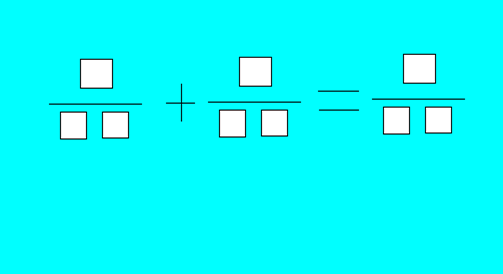
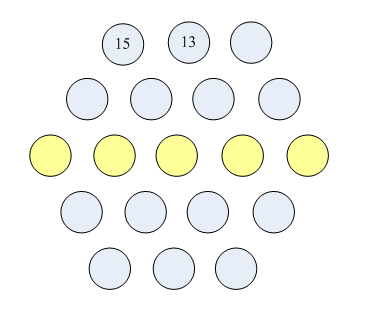

### 一

 日本数学家桥本吉彦教授于1993年10月在我国山东举行的中日美三国数学教育研讨会上向与会者提出以下填数趣题：把1~9这9个数字填入下式的9个方格中（数字不得重复），使下面的分数等式成立

桥本教授当即给出了一个解答。

1/32+5/96=7/84

这一分数式填数趣题究竟共有多少个解答？

试求出所有解答，每个占一行（等式左边两个分数交换次序只算一个解答）。



**【样例输出】**

```
1/26+5/78=4/39
1/32+5/96=7/84
1/32+7/96=5/48
1/78+4/39=6/52
1/96+7/48=5/32
2/68+9/34=5/17
2/68+9/51=7/34
4/56+7/98=3/21
5/26+9/78=4/13
6/34+8/51=9/27
```

**解答**


### 二

1221是一个非常特殊的数，它从左边读和从右边读是一样的，编程求所有这样的四位十进制数。
**【输出形式】**
1221是一个非常特殊的数，它从左边读和从右边读是一样的，编程求所有这样的四位十进制数。

**解答**

```java
public class p2{
	public static void main(String[] args){	
		
		for(int i = 1000; i < 10000; i ++)
			if(take(i, 1) == take(i, 1000) && take(i, 10) == take(i, 100))
				System.out.println(i);
	}

	// 从整数i中取出j位的数 j代表数量级
	static int take(int i, int j){
		int i_j = 0;  // i的j位数
		if(j == 1) i_j = i%10;
		if(j == 10) i_j = (i%100 - take(i, 1))/10;
		if(j == 100) i_j = (i%1000 - take(i, 10)*10 - take(i, 1))/100;
		if(j == 1000) i_j = (i%10000 - take(i, 100)*100 - take(i, 10)*10 - take(i, 1))/1000;

		return i_j;  // 返回该位上的数
	}
}

// 1001
// 1111
// 1221
// 1331
// 1441
// 1551
// 1661
// 1771
// 1881
// 1991
// 2002
// 2112
// 2222
// 2332
// 2442
// 2552
// 2662
// 2772
// 2882
// 2992
// 3003
// 3113
// 3223
// 3333
// 3443
// 3553
// 3663
// 3773
// 3883
// 3993
// 4004
// 4114
// 4224
// 4334
// 4444
// 4554
// 4664
// 4774
// 4884
// 4994
// 5005
// 5115
// 5225
// 5335
// 5445
// 5555
// 5665
// 5775
// 5885
// 5995
// 6006
// 6116
// 6226
// 6336
// 6446
// 6556
// 6666
// 6776
// 6886
// 6996
// 7007
// 7117
// 7227
// 7337
// 7447
// 7557
// 7667
// 7777
// 7887
// 7997
// 8008
// 8118
// 8228
// 8338
// 8448
// 8558
// 8668
// 8778
// 8888
// 8998
// 9009
// 9119
// 9229
// 9339
// 9449
// 9559
// 9669
// 9779
// 9889
// 9999
```


### 三

编写程序，判断某个给定字符是否为数字。
**【输入形式】**
一个字符
**【输出形式】**
如果是数字，输出yes，否则，输出no
**【样例输入】**

```
9
```


**【样例输出】**

```
yes
```

**解答**

```java
import java.util.Scanner;

public class p3{
	public static void main(String[] args){
		Scanner scanner = new Scanner(System.in);

		String str = scanner.nextLine();
		char[] Char1 = str.toCharArray();
		if(Char1[0] >= '0' && Char1[0] <= '9')
			System.out.println("yes");
		else{
			System.out.println("no");
		}
		
	}
}
```


### 四

编程判断一个字符串是否是回文，当字符串是回文时，输出字符串：yes!，否则输出字符串：no!。所谓回文即正向与反向的拼写都一样，如adgda。长度在100以内，且全为小写字母
**【样例输入】**

```
adgda
```


**【样例输出】**

```
yes!
```

**解答**

```java
import java.util.Scanner;

public class p3{
	public static void main(String[] args){
		Scanner scanner = new Scanner(System.in);
		
		String str = scanner.nextLine();
		char[] Char1 = str.toCharArray();	
		if(aba(Char1, 0, Char1.length-1)) 
			System.out.println("yes!");
		else 
			System.out.println("no!");	
	}

	// 判断是否是回文数
	static boolean aba(char[] CharArray, int i, int j){
		if(i == j ) return true;
		if(i > j) return false;
		if(i < j)
			if(CharArray[i] != CharArray[j]) 
				return false;
			aba(CharArray, ++i, --j);
			return true;
		
	}
}
```


### 五

企业发放的奖金根据利润提成。利润低于或等于10万元时，奖金可提10%；利润高于10万元，低于20万元时，低于10万元的部分按10%提成，高于10万元的部分，可提成7.5%；20万到40万之间时，高于20万元的部分，可提成5%；40万元到60万元之间时高于40万元的部分，可提成3%；60万到100万之间时，高于60万元的部分，可提成1.5%；高于100万元时，超过100万元的部分按1%提成。从键盘输入当月利润，求应发放奖金总数？（保留两位小数）利润的大小在double以内
**【输入形式】**
210000
**【输出形式】**
18000.00

**解答**

```java
import java.util.Scanner;

public class p5{
	public static void main(String[] args){
		Scanner scanner = new Scanner(System.in);

		double Profit = scanner.nextDouble();
		double BonusSum = Profit_To_Bonus(Profit);
		System.out.println(String.format("%.2f", BonusSum));
	}

	static double Profit_To_Bonus(double Profit){
		double Bonus = 0.00;
		if(Profit <= 100000)
			Bonus = Profit*0.1;
		if(Profit > 100000){
			if(Profit <= 200000)
				Bonus = Profit_To_Bonus(100000) + (Profit-100000)*0.075;
			if(Profit <= 400000 && Profit > 200000)
				Bonus = Profit_To_Bonus(200000)+ (Profit-200000)*0.05;
			if(Profit > 400000 && Profit <= 600000)
				Bonus = Profit_To_Bonus(400000) + (Profit-400000)*0.03;
			if(Profit > 600000 && Profit <= 1000000)
				Bonus = Profit_To_Bonus(600000) + (Profit-600000)*0.01;
			if(Profit > 1000000)
				Bonus = Profit_To_Bonus(1000000) + (Profit-1000000)*0.01;
		}
		return Bonus;
	}
}
```


### 六

素数就是不能再进行等分的数。比如：2 3 5 7 11 等。
  9 = 3 * 3 说明它可以3等分，因而不是素数。
  我们国家在1949年建国。如果只给你 1 9 4 9 这4个数字卡片，可以随意摆放它们的先后顺序（但卡片不能倒着摆放啊，我们不是在脑筋急转弯！），那么，你能组成多少个4位的素数呢？
  比如：1949，4919 都符合要求。
请你提交：能组成的4位素数的个数，不要罗列这些素数!!

(这是蓝桥杯真题，原题为结果填空题。这里以编程题的形式供大家练习)

**解答**

```

```


### 七

给定圆的半径r，求圆的面积。
**【输入形式】**
输入包含一个整数r，表示圆的半径。
**【输出形式】**
输出一行，包含一个实数，四舍五入保留小数点后7位，表示圆的面积。
**【样例输入】**

```
4
```


**【样例输出】**

```
50.2654825
```


**【提示】**
1 <= r <= 10000。

**解答**

```

```


### **八**

给定一个英文字母判断这个字母是大写还是小写。
**【输入形式】**
　输入只包含一个英文字母c。
**【输出形式】**
如果c是大写字母，输出“upper”，否则输出“lower”。
**【样例输入】**

```
x
```


**【样例输出】**

```
lower
```

**解答**


### 九

任何一个正整数都可以用2的幂次方表示。例如：
　　137=2^7+2^3+2^0
　　同时约定方次用括号来表示，即a^b 可表示为a（b）。
　　由此可知，137可表示为：
　　2（7）+2（3）+2（0）
　　进一步：7= 2^2+2+2^0 （2^1用2表示）
　　3=2+2^0
　　所以最后137可表示为：
　　2（2（2）+2+2（0））+2（2+2（0））+2（0）
　　又如：
　　1315=2^10 +2^8 +2^5 +2+1
　　所以1315最后可表示为：
　　2（2（2+2（0））+2）+2（2（2+2（0）））+2（2（2）+2（0））+2+2（0）
**【输入形式】**
输入包含一个正整数N（N<=20000），为要求分解的整数。
**【输出形式】**
程序输出包含一行字符串，为符合约定的n的0，2表示（在表示中不能有空格）
**【样例输入】**

```
1315
```


**【样例输出】**

```
2(2(2+2(0))+2)+2(2(2+2(0)))+2(2(2)+2(0))+2+2(0)
```

**解答**


### 十

　十六进制数是在程序设计时经常要使用到的一种整数的表示方式。它有0,1,2,3,4,5,6,7,8,9,A,B,C,D,E,F共16个符号，分别表示十进制数的0至15。十六进制的计数方法是满16进1，所以十进制数16在十六进制中是10，而十进制的17在十六进制中是11，以此类推，十进制的30在十六进制中是1E。
　　给出一个非负整数，将它表示成十六进制的形式。
**【输入形式】**

　　输入包含一个非负整数a，表示要转换的数。0<=a<=2147483647


**【输出形式】**
输出这个整数的16进制表示
**【样例输入】**

```
30
```


**【样例输出】**

```
1E
```

**解答**


### 十一

把一个整数的每个数位都平方后求和，又得到一个整数，我们称这个整数为：位平方和。

对新得到的整数仍然可以继续这一运算过程。

比如，给定整数为4，则一系列的运算结果为：

16,37,58,89,....

本题的要求是，已知一个整数x，求第n步的运算结果。

数据格式要求：

输入，两个整数x n，中间以空格分开。表示求x的第n步位平方和。其中，x，n都大于0，且小于100000。
输出，一个整数，表示所求结果。

例如，
输入：
4 3
则程序应该输出：
58

资源约定：
峰值内存消耗 < 256M
CPU消耗 < 1000ms


请严格按要求输出，不要画蛇添足地打印类似：“请您输入...” 的多余内容。

所有代码放在同一个源文件中，调试通过后，拷贝提交该源码。

注意: main函数需要返回0
注意: 只使用ANSI C/ANSI C++ 标准，不要调用依赖于编译环境或操作系统的特殊函数。
注意: 所有依赖的函数必须明确地在源文件中 #include <xxx>， 不能通过工程设置而省略常用头文件。

提交时，注意选择所期望的编译器类型。

**解答**


### 十二

题目描述

•    把 1 2 3 ... 19 共19个整数排列成六角形状，如下：
•    * * *
•   * * * *
•  * * * * *
•   * * * *
•    * * *
•    要求每个直线上的数字之和必须相等。共有15条直线哦！
•    再给点线索吧！我们预先填好了2个数字，第一行的头两个数字是：15 13，参见图【p1.png】，黄色一行为所求。



  请你填写出中间一行的5个数字。数字间用空格分开。

•  这是一行用空格分开的整数，请通过浏览器提交答案，不要填写任何多余的内容（比如说明性的文字等）

**解答**

```

```


### 十三

给定一个t，将t秒转化为HH:MM:SS的形式，表示HH小时MM分钟SS秒。HHMMSS均是两位数，如果小于10用0补到两位。
**【输入形式】**
第一行一个数T(1<=T<=100000)，表示数据组数。后面每组数据读入一个数t，0<=t<24*60*60。
**【输出形式】**
每组数据一行，HH:MM:SS。
**【样例输入】**

```
2
0
86399
```


**【样例输出】**

```
00:00:00
23:59:59
```

**解答**


### 十四

观察数字：12321，123321 都有一个共同的特征，无论从左到右读还是从右向左读，都是相同的。这样的数字叫做：回文数字。

　　本题要求你找到一些5位或6位的十进制数字。满足如下要求：
　　该数字的各个数位之和等于输入的整数。
**【输入形式】**
　一个正整数 n (10<n<100), 表示要求满足的数位和。
**【输出形式】**
　若干行，每行包含一个满足要求的5位或6位整数。
　　数字按从小到大的顺序排列。
　　如果没有满足条件的，输出：-1
**【样例输入】**

```
44
```


**【样例输出】**

```
99899
499994
589985
598895
679976
688886
697796
769967
778877
787787
796697
859958
868868
877778
886688
895598
949949
958859
967769
976679
985589
994499
```

**解答**


### 十五

共有5个红领巾，编号分别为A、B、C、D、E，老奶奶被他们其中一个扶过了马路。
　　五个红领巾各自说话：
　　A ：我和E都没有扶老奶奶
　　B ：老奶奶是被C和E其中一个扶过大街的
　　C ：老奶奶是被我和D其中一个扶过大街的
　　D ：B和C都没有扶老奶奶过街
　　E ：我没有扶老奶奶
　　已知五个红领巾中有且只有２个人说的是真话，请问是谁扶这老奶奶过了街？
　　若有多个答案，在一行中输出，编号之间用空格隔开
　　例如
　　A B C D E（这显然不是正确答案）

**解答**


### 十六

给出一个包含n个整数的数列，问整数a在数列中的第一次出现是第几个。
**【输入形式】**
第一行包含一个整数n。
第二行包含n个非负整数，为给定的数列，数列中的每个数都不大于10000。
第三行包含一个整数a，为待查找的数。

**【输出形式】**
如果a在数列中出现了，输出它第一次出现的位置(位置从1开始编号)，否则输出-1。
**【样例输入】**

```
6
1 9 4 8 3 9
9
```


**【样例输出】**

```
2
```


**【提示】**
数据规模与约定
1 <= n <= 1000

**解答**


### 十七

求出5个字符串中最长的字符串。每个字符串长度在100以内，且全为小写字母。
**【样例输入】**

```
one two three four five
```


**【样例输出】**

```
three
```

**解答**

